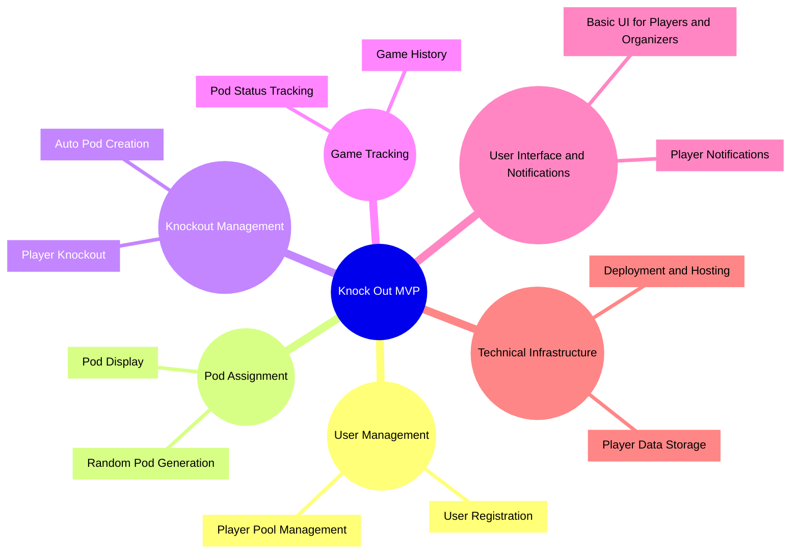

# Knock Out 🤜

**Knock Out** is a digital solution for managing a unique Magic: The Gathering Commander meta-format. It automates the process of assigning players to pods, managing knockouts, and dynamically creating new games as players become available.

## Features
- **Dynamic Pod Assignment**: Players are randomly assigned to Commander pods for their games.
- **Knockout Management**: Tracks when a player is knocked out and returns them to the pool of available players.
- **Automated Game Creation**: Automatically generates new pods when enough players are available.
- **Cross-Platform Accessibility**: Start with a web-based MVP and expand to dedicated phone apps for iOS and Android.
- **Scalable Architecture**: Built to handle small local groups or large Commander tournaments.

