# Knock Out 🤜

**Knock Out** is a digital solution for managing a unique Magic: The Gathering Commander meta-format. This system automates the process of assigning players to pods, tracking knockouts, and dynamically creating new games as players return to the pool.

## The Format

The "Knock Out" format adds an exciting twist to the traditional Magic: The Gathering Commander experience. Here's how it works:

1. **Pod Assignment**:
   - All players are randomly assigned to tables (or "pods") of 4 players.
   - Each pod plays a standard Commander game.

2. **Knockout Mechanic**:
   - When a player is eliminated from their game, they are "Knocked Out."
   - Knocked-out players are returned to the **player pool**.

3. **Dynamic Pod Creation**:
   - As players return to the pool, the system monitors availability.
   - When 4 players are available in the pool, a new pod is created, and the cycle begins again.

This process repeats until all games are completed, making it a scalable and dynamic system for tournaments or casual events.

## Features
- **Dynamic Pod Assignment**: Players are randomly assigned to Commander pods for each round.
- **Knockout Management**: Tracks player eliminations and returns them to the pool.
- **Automated Game Creation**: Automatically generates new pods when enough players are available.
- **Cross-Platform Accessibility**: Start with a web-based MVP and expand to phone apps for iOS and Android.
- **Scalable Architecture**: Supports both local playgroups and larger Commander tournaments.

## Visualizing the Format

---

## MVP Features

```mermaid
mindmap
  root((Knock Out MVP))
    Epic1(("✨1 - User Management"))
      PBI1.1["User Registration"]
      PBI1.2["Player Pool Management"]
    Epic2(("Pod Assignment"))
      PBI2.1["Random Pod Generation"]
      PBI2.2["Pod Display"]
    Epic3(("Knockout Management"))
      PBI3.1["Player Knockout"]
      PBI3.2["Auto Pod Creation"]
    Epic4(("Game Tracking"))
      PBI4.1["Pod Status Tracking"]
      PBI4.2["Game History"]
    Epic5(("User Interface and Notifications"))
      PBI5.1["Basic UI for Players and Organizers"]
      PBI5.2["Player Notifications"]
    Epic6(("Technical Infrastructure"))
      PBI6.1["Player Data Storage"]
      PBI6.2["Deployment and Hosting"]
```

### Diagram Explanation:
1. **Epics** are represented as `subgraph` nodes, with their titles clearly labeled.
2. **PBIs** are listed as individual nodes branching off from their respective Epic.
3. The structure is straightforward, emphasizing the relationship between each Epic and its PBIs.
